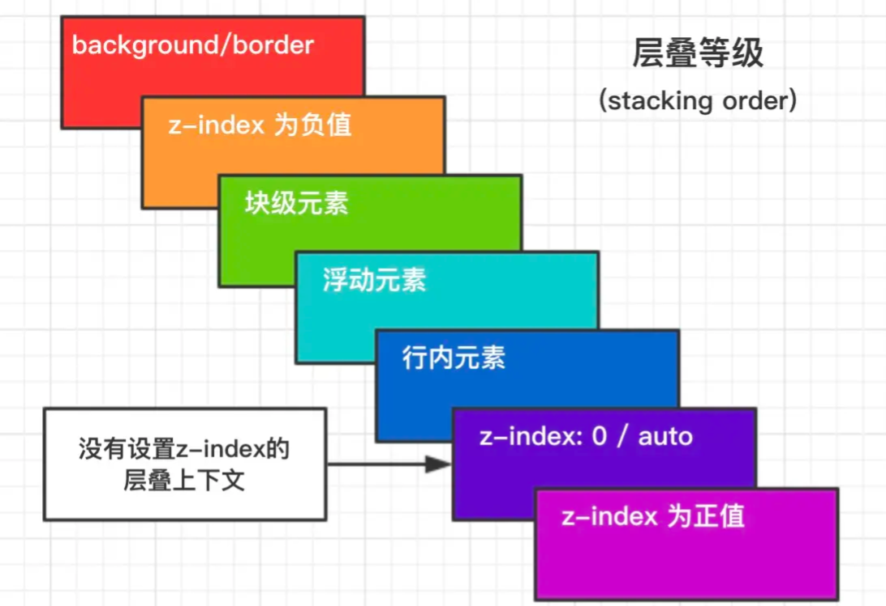

层叠上下文: 元素提升为一个比较特殊的图层，在三维空间中 (z轴) 高出普通元素一等。

## 触发条件

    - 根层叠上下文(html)
    - position
    - css3属性:
      flex
      transform值不是none
      opacity值不是1
      filter值不是none
      will-change
      -webkit-overflow-scrolling设为touch

## 层叠等级：层叠上下文在z轴上的排序
  在同一层叠上下文中，层叠等级才有意义
  z-index的优先级最高
  