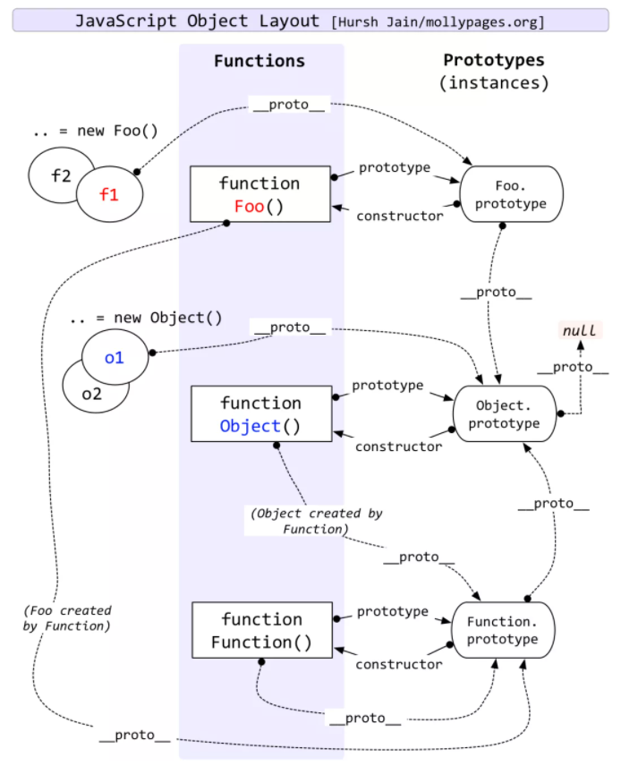

## [原型](https://juejin.cn/post/6934498361475072014)

    js是基于对象的，对象分为普通对象和函数对象：
    函数对象有prototype属性，也称为原型对象，默认有constructor属性，指向自身。
    每一个对象都有__proto__，指向所创建类的 prototype（fn.__proto__ === Fn.prototype）

作用： 共享方法

原型中的this指向实例

## 原型链

原型对象也可以有原型，一层层的继承方法和属性，当访问一个对象的属性或者方法，当前对象找不到就会通过__proto__一层层的向上找。