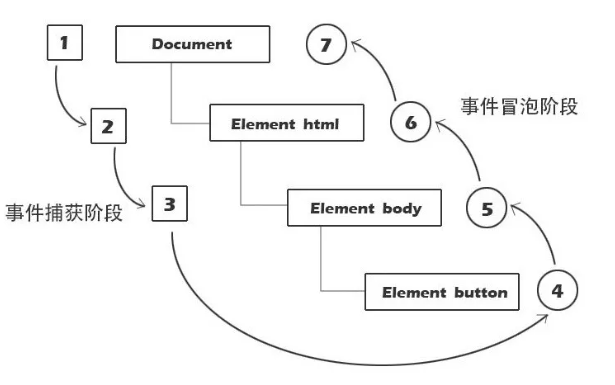

事件流是页面元素接收事件的顺序，包含三个阶段：事件捕获阶段-->处于目标阶段-->事件冒泡阶段。

## 流程

当容器元素及嵌套元素，即在捕获阶段又在冒泡阶段调用事件处理程序时：事件按DOM事件流的顺序执行事件处理程序：

1、父级捕获  
2、子级捕获  
3、子级冒泡  
4、父级冒泡  
（浏览器不同，执行结果略有不同）

## 兼容事件对象封装
    var EventUtil = {
      addHandler: function (el, type, handler) {
          if (el.addEventListener) {
              el.addEventListener(type, handler, false);
          } else if (el.attachEvent) {
              el.attachEvent('on' + type, handler);
          } else {
              el['on' + type] = handler;
          }
      },
      removeHandler: function (el, type, handler) {
          if (el.removeEventListener) {
              el.removeEventListerner(type, handler, false);
          } else if (el.detachEvent) {
              el.detachEvent('on' + type, handler);
          } else {
              el['on' + type] = null;
          }
      },
      getEvent: function (e) {
          return e ? e : window.event;
      },
      getTarget: function (e) {
          return e.target ? e.target : e.srcElement;
      },
      preventDefault: function (e) {
          if (e.preventDefault) {
              e.preventDefault();
          } else {
              e.returnValue = false;
          }
      },
      stopPropagation: function (e) {
          if (e.stopPropagation) {
              e.stopPropagation();
          } else {
              e.cancelBubble = true;
          }
      }
    };