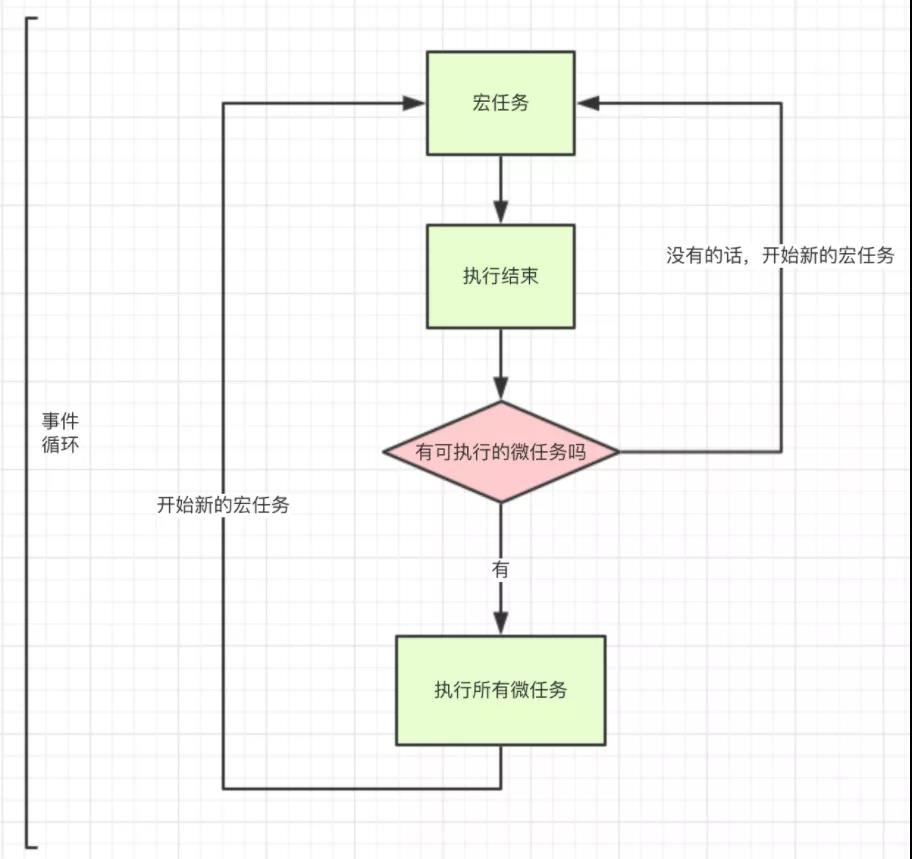

js是单线程的，程序运行时只能有一个线程存在，同一时间只能干一件事情。通过事件循环机制解决单线程运行阻塞的问题。

js任务分为同步和异步任务，同步任务即立即执行的任务，一般直接进入主线程；异步执行的任务则是Ajax网络请求，时间函数等，会进入任务队列。主线程的任务执行完毕，就会去任务队列读取对应的任务并执行，事件循环就是主线程不断的循环的从任务队列中读取任务。

异步任务又被细分为微任务和宏任务：

    promise, async/await, process.nextTick等就是微任务。
    定时器，事件绑定，ajax，回调函数，node中fs操作模块等就是宏任务

执行机制：

    先执行一个宏任务，遇到微任务将它放入微任务事件队列
    执行完当前宏任务后，查看当前微任务队列并执行完
    进入下一个宏任务

#### 为什么有微任务

  解决异步回调的问题，队列遵循“先进先出的”的数据结构，通过回调进入新的宏任务会造成队列过长，回调时间变长，页面卡顿的问题。

#### 为什么 await 后面的代码会进入到promise队列中的微任务

    async/await 是generator和promise的语法糖，await后面的语句会被放加入微任务队列。