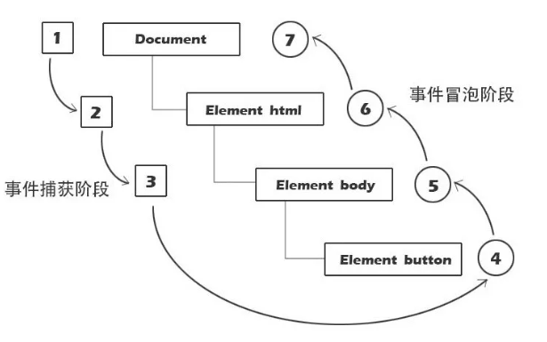

事件流是页面元素接收事件的顺序，包含三个阶段：事件捕获阶段-->处于目标阶段-->事件冒泡阶段。

## 梳理

事件冒泡（Event Bubbling）是 DOM 事件流机制的一部分，由 DOM 标准（DOM Level 2/3 Events） 定义。是否冒泡，完全取决于该事件类型在 DOM 规范中的设计，而不是浏览器或框架随意决定的。

- 重点记忆:
    所有 用户交互行为（点击、输入、拖拽）基本都冒泡
    focusin / focusout 是 focus / blur 的冒泡版本

- 不冒泡时间
| 事件类型 | 常见事件 | 原因 |
|--------|--------|------|
| 焦点 | `focus`, `blur` | 设计上只关心目标元素状态 |
| 鼠标进出 | `mouseenter`, `mouseleave` | 避免子元素干扰（与 `mouseover/out` 区分）|
| 资源加载 | `load`, `unload`, `abort`, `error`（部分） | 事件与特定资源绑定，无需冒泡 |
| 窗口/UI | `resize`, `scroll` | 传统上不冒泡，但现代浏览器中 `scroll` 实际会冒泡 |
| 媒体 | `play`, `pause`, `ended`, `canplay` | 仅与媒体元素自身相关 |
| 动画 | `animationstart`, `animationend` | 不冒泡（但 `transitionend` 会冒泡！）|

## 流程

当容器元素及嵌套元素，即在捕获阶段又在冒泡阶段调用事件处理程序时：事件按DOM事件流的顺序执行事件处理程序：

1、父级捕获  
2、子级捕获  
3、子级冒泡  
4、父级冒泡  
（浏览器不同，执行结果略有不同）

## 兼容事件对象封装

    addEventListener默认是冒泡

    var EventUtil = {
      addHandler: function (el, type, handler) {
          if (el.addEventListener) {
              el.addEventListener(type, handler, false);
          } else if (el.attachEvent) {
              el.attachEvent('on' + type, handler);
          } else {
              el['on' + type] = handler;
          }
      },
      removeHandler: function (el, type, handler) {
          if (el.removeEventListener) {
              el.removeEventListerner(type, handler, false);
          } else if (el.detachEvent) {
              el.detachEvent('on' + type, handler);
          } else {
              el['on' + type] = null;
          }
      },
      getEvent: function (e) {
          return e ? e : window.event;
      },
      getTarget: function (e) {
          return e.target ? e.target : e.srcElement;
      },
      preventDefault: function (e) {
          if (e.preventDefault) {
              e.preventDefault();
          } else {
              e.returnValue = false;
          }
      },
      stopPropagation: function (e) {
          if (e.stopPropagation) {
              e.stopPropagation();
          } else {
              e.cancelBubble = true;
          }
      }
    };

