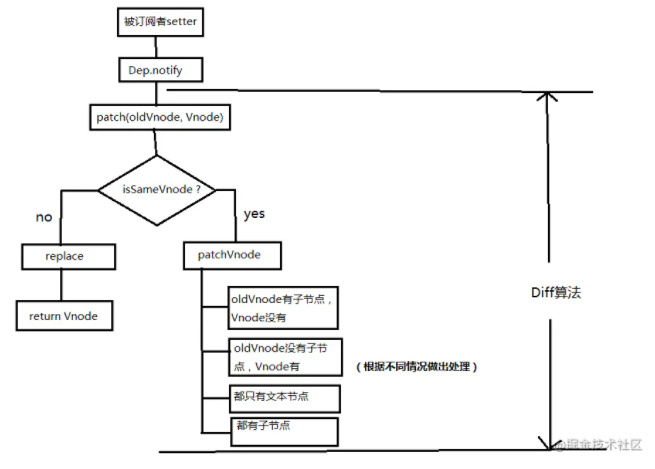

### Vue 2.0

diff 算法是一种通过同层的树节点进行比较的高级算法 -- 双端比较。作用于虚拟 DOM 渲染成真实 DOM 的新旧VNode 节点比较

特点：

  - 只会在同层级进行比较，不会跨层级比较
  - 在比较过程中，循环从两边向中间比较

diff整体策略为：深度优先，同层比较

diff流程图：

    diff的过程就是调用名为patch的函数，比较新旧节点，一边比较一边给真实的DOM打补丁

- 同级比较，再比较子节点

- 先对比一方有子节点一方没有子节点的情况（如果新的children没有子节点，将旧的子节点移除）

- 比较都有子节点的情况

- 递归比较子节点

###　Vue3.0 diff

在创建VNode时就确定类型，以及在mount/patch的过程中采用 `位运算` 来判断一个VNode的类型，在这个基础上再配合核心的diff算法，使得性能比Vue2有所提升

    该算法中还运用了 动态规划 思想求解最长递归子序列 