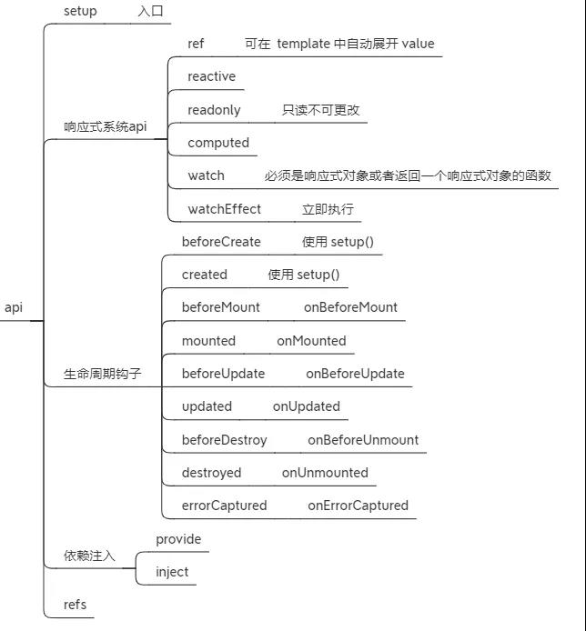

### Vue3新特性

1. framents 支持多个根节点

  ```html
    <!-- Layout.vue -->
    <template>
      <header>...</header>
      <main v-bind="$attrs">...</main>
      <footer>...</footer>
    </template>
  ```

2. Teleport 传入 ---- 也可以叫任意传送门

能够将我们的模板移动到DOM中除了Vue app之外的位置，to 属性就是目标位置

3. createRenderer

通过createRenderer能够构建自定义渲染器，将vue 的开发模型扩展到其他平台

4. composition Api

组合式API

  

### 非兼容变更

Global API

  - 全局 Vue API 已更改为使用应用程序实例
  ```
    Vue.component变更为app.component
    Vue.directive变更为app.directive
    Vue.mixin变更为app.mixin
    Vue.use变更为app.use
    Vue.config变更为app.config
    Vue.config.ignoredElements变更为app.config.ignoredElements
  ```
  全局和内部 API 已经被重构为可 tree-shakable