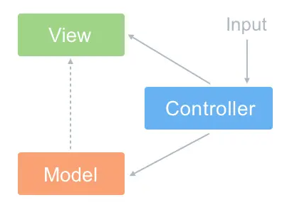

### MVC

是 Model View Controller 的缩写

- Model：(数据层) 用来处理业务的数据逻辑部分
- View：(视图层) UI视图，处理数据显示的部分
- Controller：(控制器) 业务逻辑，处理用户交互的部分

Controller负责将Model的数据用 View显示出来（在 Controller 里面把 Model 的数据赋值给 View）

MVC的优点：

    耦合度低，视图层和业务层分离
    可重用性
    生命周期成本低
    可维护性高
    部署快

缺点：

    不适合小型项目
    视图和控制器紧密连接降低了视图对模型数据的访问

应用场景：主要用于中大型项目的分层开发

### MVVM

- Model：(数据层) 用来处理业务的数据逻辑部分
- View：(视图层) UI视图，处理数据显示的部分
- ViewModal: (视图模型) 处理业务逻辑，是连接view和model的桥梁，实现了双向绑定，将Model转为View -- 数据绑定；将View转为Model -- DOM事件监听

优点：

  耦合度低，视图层和业务层分离
  可重用性
  独立开发
  可测试
  双向绑定

缺点：

    难以调试

应用场景：以数据驱动的项目

### 区别

    MVVM比MVC精简，不仅简化了业务和界面的依赖，也解决了数据频繁更新的问题
    MVVM不用操作DOM元素
    MVVM是双向绑定的

### 为什么Vue没有完全遵循MVVM

  严格的MVVM要求View和Model不能直接通信，但Vue提供了$refs属性，让Model能够直接操作View