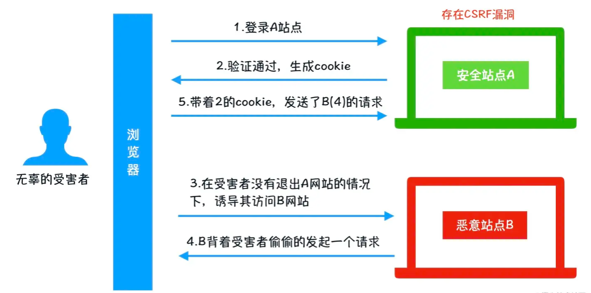

### 前端有哪些攻击方式

  - XSS攻击(跨站脚本攻击)
  - CSRF攻击（跨站请求伪造）
  - 点击劫持

#### 什么是XSS攻击？XSS攻击有几种类型？如果防范XSS攻击？

  XSS(Cross-Site Scripting，跨站脚本攻击)是一种代码注入攻击。

  攻击者在目标网站上注入恶意代码，当被攻击者访问网站时就会执行这些恶意代码，脚本可以读取cookie，session token，或者其他敏感信息。

  影响：

    利用虚假输入表单骗取用户个人信息

    利用脚本窃取用户的cookie值，在被攻击者不知情的情况下，帮助攻击者发送恶意请求

    显示伪造的文章或者图片

  xss攻击分为：

  1、储存型（持久型）

  恶意代码永久储存在目标服务器上，一般存在于From表单提交等交互功能，如文字留言，提交文本信息等。

    在评论中输入以下内容：
  
  防范：

    1、转义字符

      前端数据传递给服务器前先转译/过滤
      服务器接收数据储存前进行转译/过滤
      前端接收服务器数据，展示前先转译/过滤
    
    2、CSP（Content Security Policy）内容安全策略

      本质是建立白名单，告诉浏览器外部哪些资源可以加载执行，由浏览器自己实现拦截。

      通过两种方式来开启 CSP：

        1）设置HTTPHeader中的Content Security Policy
          default-src 'self'：只允许加载本站资源
          img-src https://*： 只允许加载 HTTPS 协议图片
          允许加载任何来源框架： child-src 'none'

        2）设置mete标签

      前端和服务端设置 CSP 的效果相同，但是meta无法使用report
    
    3、HttpOnly Cookie

      禁止 JavaScript 读取某些敏感 Cookie，预防XSS窃取cookie最有效的方法

  2、反射型（非持久型）

    一般通过给别人发送带有恶意脚本代码参数的URL，当URL地址被打开时，特有的恶意代码参数会被HTML解析执行。
    
    需要用户主动点击，所以会结合各种手段诱导用户点击
  
  防范：

  Chrome 和 Safari 内置了一些XSS过滤器，能够检测到 url 上的xss攻击，将网页拦截掉，但是其它浏览器不行，如Firefox

    1、对url的查询参数进行转义后再输出到页面。
      res.send(`${encodeURIComponent(req.query.type)}`); 
    
    2、尽量不要从 URL，document.referrer，document.forms 等这种 DOM API 中获取数据直接渲染。

    3、尽量不要用eval, new Function()，document.write()，innerHTML，document.createElement() 等可执行字符串的方法。

    4、页面渲染的内容和数据必须来自服务器

  攻击步骤：

    1、攻击者构造出特殊的URL，包含恶意代码
    2、诱导用户打开恶意URL，网站服务器取出恶意代码拼接在HTML中返回给浏览器
    3、浏览器接收到响应后解析执行，恶意代码也会被执行
    4、根据恶意指令做出相对应的攻击

  
  3、DOM型

  一种特殊的反射型XSS，是基于Document文档对象的XSS攻击。，将不可信的内容插入到页面上。

    使用.innerHTML、.outerHTML、.appendChild、document.write()等API时要特别小心，不要把不可信的数据作为 HTML 插到页面上，尽量使用 .innerText、.textContent、.setAttribute() 等。
  
  防范：

    对输入内容进行转译（DOM 中的内联事件监听器和链接跳转都能把字符串作为代码运行，需要对其内容进行检查）

#### 什么是CSRF攻击？如何防范CSRF攻击

  CSRF(Cross Site Request Forgery)，即跨站请求伪造，是一种常见的Web攻击，它利用用户已登录的身份，在用户毫不知情的情况下，以用户的名义完成非法操作。

  

  攻击流程：

    1、受害者登录A站点，并保留了登录凭证（Cookie）。
    2、攻击者诱导受害者访问了站点B。
    3、站点B向站点A发送了一个请求，浏览器会默认携带站点A的Cookie信息。
    4、站点A接收到请求后，对请求进行验证，并确认是受害者的凭证，误以为是无辜的受害者发送的请求。
    5、站点A以受害者的名义执行了站点B的请求。
    6、攻击完成，攻击者在受害者不知情的情况下，冒充受害者完成了攻击。
  
  CSRF 攻击防御：
  
  1、添加验证码

    添加验证码校验能够防御攻击，但有一定体验问题，每次交互都需要验证码对用户体验会非常差。可以在交易转账等重要操作增加验证码
  
  2、判断请求的来源

    检测Referer，不是绝对安全的，Referer可以被更改

  3、使用Token

    服务端生成一个Token，加密后传递给用户。
    用户在提交请求时，需要携带Token。
    服务端验证Token是否正确。

    目前主流方法，跟验证码类似，只是用户无感知
  
  4、Samesite Cookie属性

    通过HTTP协议，为Set-Cookie响应头设置Samesite属性，允许请求是否包含cookie。
    Strict：是严格模式,表明这个 Cookie 在任何情况都不可能作为第三方的 Cookie。
    Lax：是宽松模式，允许get请求带上cookie

#### 什么是点击劫持？如何防范点击劫持

  点击劫持是指在网页上隐藏一个透明的iframe，用外层的页面诱导用户点击。在隐藏的iframe上触发了点击事件进行一些用户不知情的操作。

  点击劫持防御：

    1、frame busting

      if ( top.location != window.location ) {
          top.location = window.location
      }

    客户端最流行的方法，但不是最好的解决方法，因为 iframe 只是被忽略了而已。

    2、X-Frame-Options

    从服务端解决点击劫持的问题，通过HTTP头设置 X-FRAME-OPTIONS 响应头：

      DENY: 拒绝任何域加载

      SAMEORIGIN: 允许同源域下加载

      ALLOW-FROM: 可以定义允许frame加载的页面地址