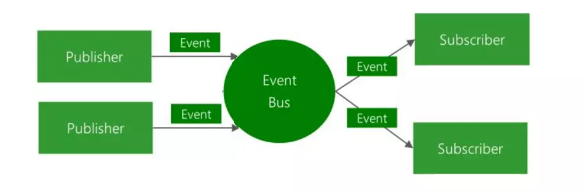

# 实现EventBus

## Intro
EventBus是一种事件发布订阅模式，可以实现跨页面、组件的解耦

## 流程


## 实现
```js
class EventBus {
  constructor() {
    this.events = {};
  }
  on(type, callback, scope, ...args) {
    if (typeof this.events[type] === 'undefined') {
      this.events[type] = [];
    }
    this.events[type].push({ type, callback, scope, args })
  }
  emit(type, ...args) {
    if (typeof this.events[type] === 'undefined') return
    const events = this.events[type].slice()
    const argArr = [...args, ...event.args]
    for(const event of events) {
      if (event.callback) {
        event.callback.call(event.scope, argArr)
      }
    }
  }
  off(type, callback, scope, ...args) {
    if (typeof this.events[type] === 'undefined') return
    const filterFn = e => e.callback !== callback ||  e.scope !== scope
    this.events[type] = this.events[type].filter(filterFn)
  }
  once(type, callback, scope) {
    const cb = (...args) => {
      callback(...args);
      this.off(type, callback, scope)
    }
    this.on(type, callback, scope, ...args)
  }
}

const eventBus = new EventBus();
```