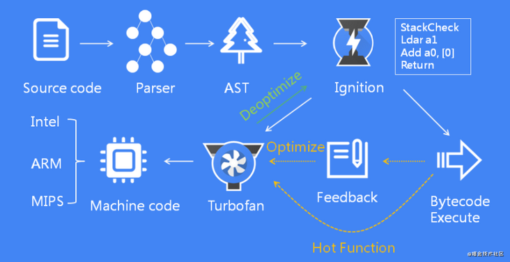

JavaScript引擎是将JavaScript源码转换为更高效的机器代码，而V8就众多JavaScript引擎中的佼佼者，V8是一个由Google开源的采用C++编写的高性能JavaScript和WebAssembly引擎，应用在 Chrome和Node.js等中。

- 1、源代码经过Parser解析器，经过词法分析和语法分析生成AST
- 2、AST经过Ignition解释器生成字节码并执行
- 3、在执行过程中，如果发现热点代码，将热点代码交给TurboFan编译器生成机器码并执行
- 4、如果热点代码不再满足要求，进行去优化处理

这种字节码与解释器和编译器结合的技术，就是我们通常所说的即时编译(JIT)。