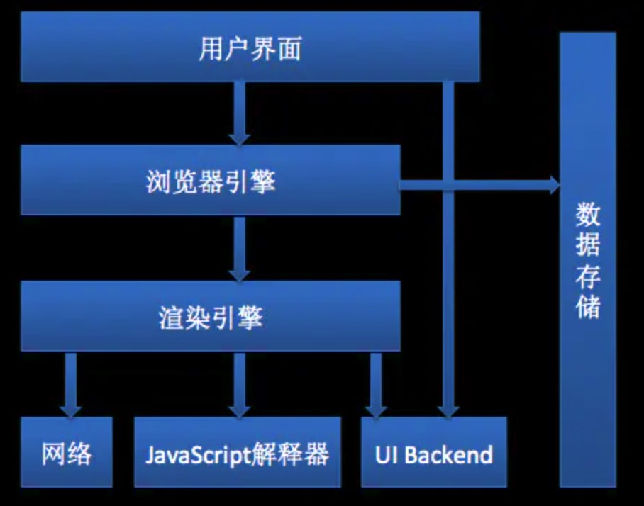

## 浏览器是那几部分组成的

浏览器是由用户界面、浏览器引擎、渲染引擎组成。

其中的渲染引擎也被称为浏览器内核，而渲染引擎的 JS 解释器就是 JS 引擎，目前市面上的浏览器基本上都是多进程架构，在Chrome中打开一个网页相当于起了一个进程。

渲染引擎是多线程的，在渲染引擎的控制下各线程相互配合以保持同步，一个浏览器通常由以下常驻线程组成：

- GUI 渲染线程
- JS 引擎线程
- 定时触发器线程
- 事件触发线程
- 异步 http 请求线程

由于 JS 是可操纵 DOM 的，GUI 渲染线程 与 JS 引擎线程互斥！，当JS引擎执行时 GUI 线程会被挂起，GUI更新会被保存在一个队列中等到引擎线程空闲时立即被执行。因此如果 JS 执行的时间过长，这样就会造成页面的渲染不连贯，导致页面渲染加载阻塞的感觉。

我们常常听到，JS 是单线程，那么为什么 Js 要是单线程的？上面说道 JS 是可操纵 DOM 的，假设存在两个线程同时操作一个 DOM，一个负责修改一个负责删除，那么这个时候就需要浏览器来裁决如何生效哪个线程的执行结果。当然我们可以通过锁来解决上面的问题。但为了避免因为引入了锁而带来更大的复杂性，JS 在最初就选择了单线程执行。

在浏览器或者node端，定时计数器并不是由 JS 引擎计数的, 因为 JS 引擎是单线程的, 如果处于阻塞线程状态就会影响记计时的准确, 因此通过单独线程来计时并触发定时是更为合理的方案。但因此在 Event Loop 中，我们在使用定时器计数的时候，由于宏任务与微任务的优先级，形成的阻塞，我们会发现定时器并不能完全准确的计时，setTimeout 等会出现时间误差。下面是网上解决这种时间误差的一种解决方案：

    // 动态调整触发时间，减小误差耗时
    var startTime = new Date().getTime();
    var count = 0;

    setInterval(function(){
        // 耗时任务
        var i = 0;
        while(i++ < 100000000);
    }, 0);

    function fixed() {
        count++;
        var offset = new Date().getTime() - (startTime + count * 1000);
        var nextTime = 1000 - offset;
        if (nextTime < 0) nextTime = 0;
        setTimeout(fixed, nextTime);

        console.log(new Date().getTime() - (startTime + count * 1000));
    }

    // 虽然触发时间并非绝对准确，但是由于每次触发都进行及时修正，所以没有造成误差累积
    setTimeout(fixed, 1000);