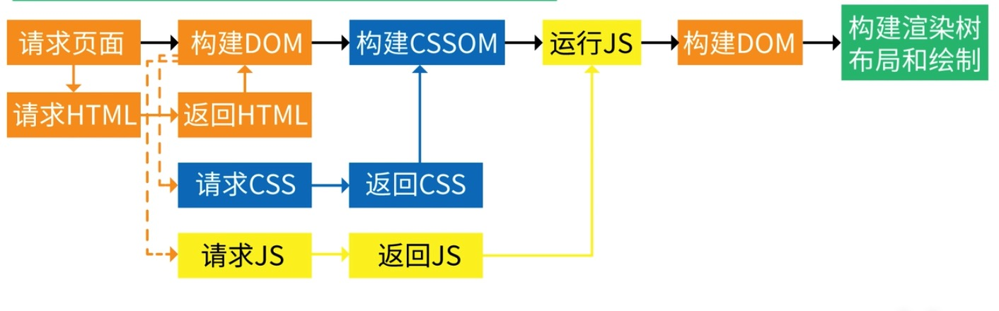

## 浏览器渲染

Safari 和 Chrome使用的渲染引擎叫做 Blink（Blink在Webkit套壳），Safari使用 Webkit，Firefox使用 Geoko。渲染引擎的作用跟JS引擎相似，把HTML等语言解释机器能看得懂的字节码，并由显卡绘制出来。

渲染引擎首先通过网络获得所请求文档的内容后，会完成以下流程：

- 1、解析 HTML 构建 DOM 树
- 2、构建渲染树
- 3、布局渲染树 ( Layout )
- 4、绘制渲染树 ( Painting )

其中渲染树是 DOM 树和 CSSDOM 树，合并生成的一个数据结构，构建渲染树的任务就是匹配 DOM 和 CSSDOM 的节点，并且捕获可见内容。

- 在布局阶段，浏览器已经知道页面的节点和CSS从属关系，计算出每个节点在屏幕中的位置。

- 在绘制阶段，渲染引擎按照算出来的规则，通过显卡，把内容画到屏幕上。

在浏览器渲染阶段还有两个很重要的概念：

- 重排 (tips: 网上有回流和重排两个说法，其实都是一个意思)
- 重绘

重绘顾名思义重新绘制，重排顾名思义重新排版。重排必将引起重绘，而重绘不一定会引起重排。当元素的几何尺寸没有变化触发的是重绘，几何元素发生变化则会触发重排。

这里回顾一下浏览器渲染过程，浏览器请求页面得到HTML，通过HTML解析器开始构建DOM，遇到css:Link就请求css，遇到script就请求js，如果先返回js，js会优先被解析执行，那么这里是会发生CSSDOM构建被阻塞的情况，从而导致渲染树生成被阻塞。DOM可部分解析，但CSSDOM不能部分解析。js 可以操作 DOM 又可以操作 CSSDOM，js 没有执行完，浏览器是不会解析DOM、CSSDOM。

