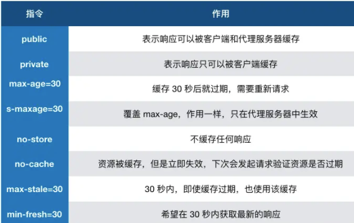

缓存分为强缓存和协商缓存：

  强缓存不过服务器，协商缓存需要过服务器。协商缓存返回的状态码是304，
  两个可以同时存在，强缓存的优先级高于协商缓存。
  若命中强缓存，则直接使用缓存数据库中的数据，不再进行协商缓存

缓存优点： 

    减少不必要的数据传输，节省带宽
    减少服务器负担，提升网站性能
    加快客户端的加载速度

缓存缺点：

    资源更改不能及时更新的风险

缓存通过设置HTTP Header 来实现的

### 强缓存

  通过设置两种 HTTP Header 实现：Expires 和 Cache-Control。

    缓存期间不需要请求，state code 为 200。
  
  - Expires: Wed, 22 Oct 2018 08:41:00 GMT 
  
    设置过去时间，受限本地时间，本地时间修改可能造成缓存失效
  
  - Cache-control: max-age=30

    出现于 HTTP/1.1，`优先级高于 Expires`
    可以在请求头或者响应头中设置，并且可以组合使用多种指令
    

### 协商缓存

  通过设置两种 HTTP Header 实现：Last-Modified 和 ETag 。

    当浏览器发起请求验证资源时，如果资源没有做改变，那么服务端就会返回 304 状态码，并且更新浏览器缓存有效期。
  
  - Last-Modified 和 If-Modified-Since

    Last-Modified表示本地最后修改日期
    If-Modified-Since 会将 Last-Modified 发给服务器询问是否更新

    Last-Modified的弊端：

    1、本地缓存文件打开会使缓存失效，导致服务器不能命中缓存发送相同资源
    2、以秒为单位，修改过快会无法返回正确的资源

  - ETag 和 If-None-Match

    ETag类似文件指纹

    If-None-Match 会将当前 ETag 发送给服务器，询问该资源 ETag 是否变动，有变动的话就将新的资源发送回来

    `ETag 优先级比 Last-Modified 高`
