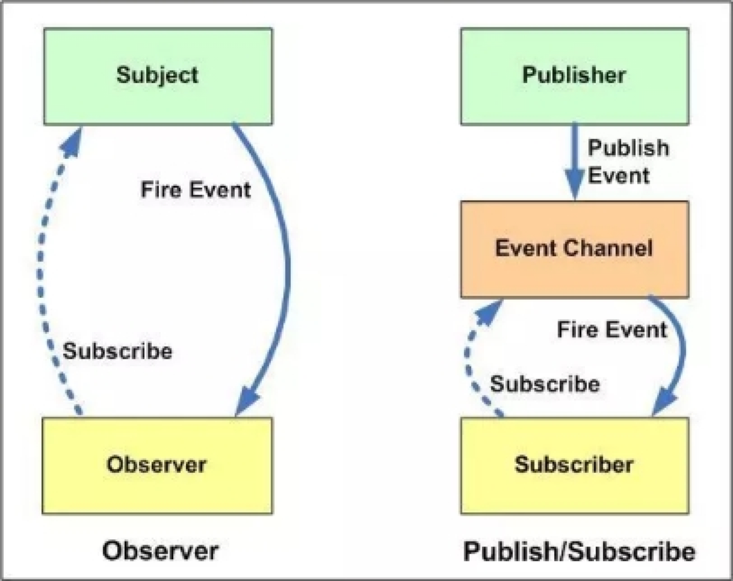

## 观察者模式：

观察者和发布者都知道双方，核心是靠松耦合实现

    class Subject {
        constructor() {
            this.subs = {}
        }

        addSub(key, fn) {
            this.subs[key] = fn
        }

        trigger(key, message) {
            let fn = this.subs[key]
            fn(message)
        }
    }

    
    let subA = new Subject()
    let A = (message) => {
        console.log('订阅者收到信息: ' + message)
    }
    subA.addSub('A', A)
    subA.trigger('A', '我是A')   // A收到信息: --> 我是A

## 发布订阅者模式：

发布者和订阅者都不知道双方，需要一个中介转发

    class Subject {
        constructor() {
            this.subs = {}
        }

        on(key, fn) {
            if( !this.subs[key] ) this.subs[key] = []
            this.subs[key].push(fn)
        }

        emit(key, message) {
            let arr = this.subs[key]
            arr.forEach((item)=>{
                item(message)
            })
        }
    }

    const eventEmitter = new Subject()

    function user1 (content) {
        console.log('用户1订阅了:', content);
    };

    function user2 (content) {
        console.log('用户2订阅了:', content);
    };

    // 订阅
    eventEmitter.on('article', user1);
    eventEmitter.on('article', user2);

    // 发布
    eventEmitter.emit('article', 'Javascript 发布-订阅模式');
## 观察者模式和发布订阅者模式的差别：

